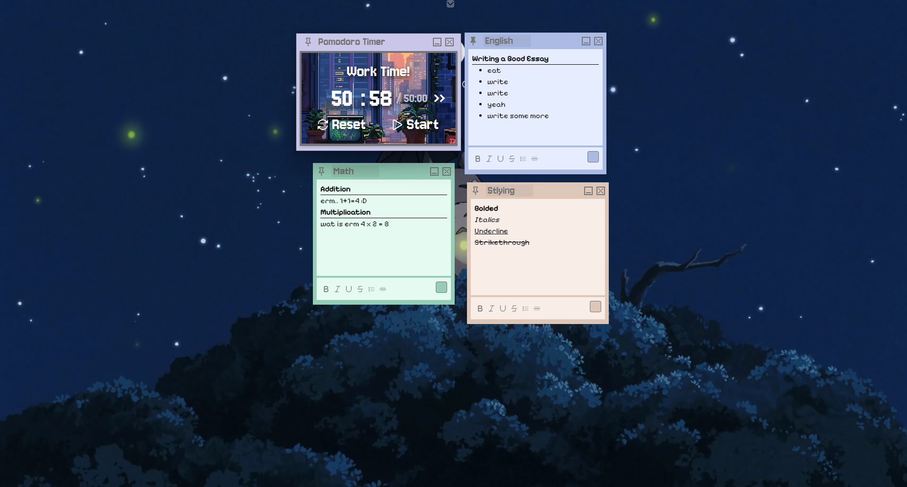
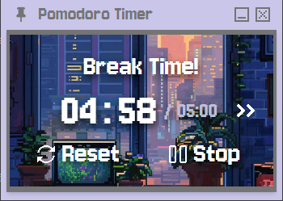

[](#)
[](#)
[](#)
[](#)
[](#)
# StickiTime
A sleek productivity desktop application that features a pomodoro timer, bookmarks, and sticky notes!


## Features

### Pomodoro Timer
- Start/stop functionality with editable session and break durations
- Switch between study and break mode with the `>>` skip button
<br>
<p float="left" align="center">
  
  
</p>

### Bookmarks
- One-click access to saved websites via your default browser
- Easily add new bookmarks with the `+ Add Bookmark` button
- Organize and manage your go-to links for productivity

<br>


### Sticky Notes
- Create notes with the `+ Sticky` button on the navbar
- Pin to stay on top of other windows (using the thumbtack icon)
- Editable note titles and rich text formatting
- Customize note color via the square button in the corner
- Minimized notes are stored in the **Stickies** folder for easy reopening

<br>


<p float="left" align="center">
  
  
  
</p>

## Build Instructions

> **Prerequisites**:  
> - [Node.js](https://nodejs.org/) (v18 or newer recommended)  
> - [Yarn](https://classic.yarnpkg.com/lang/en/) or npm  
> - OS-specific tools if building native apps (see below)

### 1. Clone and Install Dependencies
```bash
git clone https://github.com/Chris-Kau/StickiTime.git
cd StickiTime
yarn install #or npm
```
### 2. Run in Development Mode
```bash
#use yarn or npm
yarn dev 
```

### 3. Build for Production
```bash
#use yarn or npm
yarn build:win
yarn build:linux
yarn build:mac
```

### 4. Output
After building, your executable can be found in the `dist/` or `release/` folder.

## Credits
- Icons by [Pixel Icon Library](https://github.com/hackernoon/pixel-icon-library)
- [Jersey 10](https://fonts.google.com/specimen/Jersey+10) font
- [Pixelify Sans](https://fonts.google.com/share?selection.family=Pixelify+Sans:wght@400..700) font
- Badges by [Shields.io](https://github.com/inttter/md-badges)